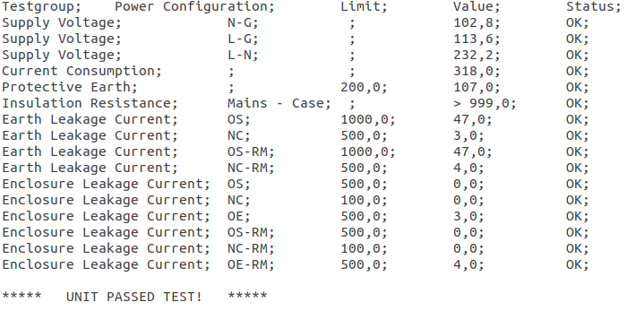

## Value Extractor
This is a Java application I've written for a friend who works at a hospital and calibrates and tests devices.

What this application does is basically that to extract values under the "Value" column from a text file (which you can find a sample in [test][1] folder) which is created by [Metron QA-90][2] and write them to an excel (`.xls`) file.

**This application works only with those specifically formatted text files. **

## What's behind 
As you can see from the sample text file, it reads the file line by line until it finds a line which contains the word "value". 



After the line found, a flag called `containsValue` is set to `true` to initiate splitting the lines into an array by `;` (semicolons) which the text file has five of them per line after the line which has the word "value".

```c
valuesList.add(line.split(";")[3].trim());
```

To get the values under the "Value" column we only need the element at the 3rd index (4th element) of the array. 

Program keeps adding those values into an `ArrayList` called `valuesList` until a blank line is hit which is controlled with `isEmpty()`. We also trim each array element to get rid of the white space at both ends.

Finally we add this value into an `ArrayList` called `valuesList` as you can see above.


[1]: https://github.com/andreyuhai/Value-Extractor/tree/master/test
[2]: https://www.celyontecnica.es/var/celyon-1051-qa90MKII.pdf
*[Metron QA-90]: Metron QA-90 Safety Analyzer

